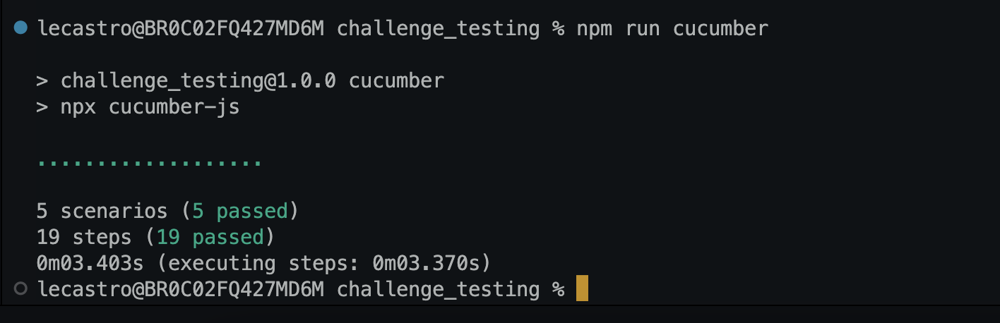
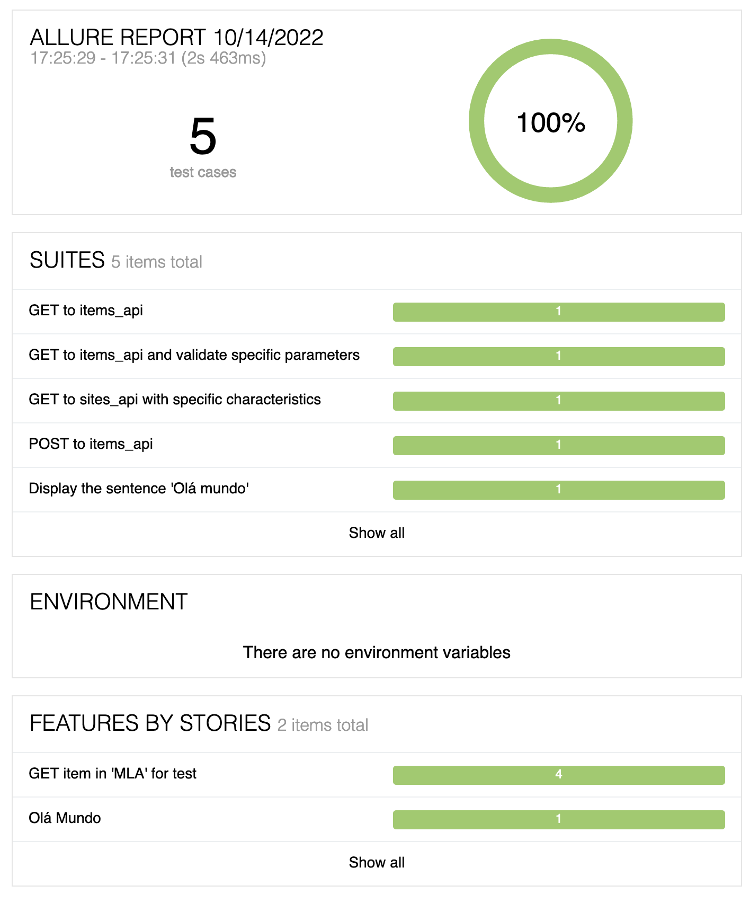

## Ejercicio de testing
# Creando una suite automatizada

Se propone como principal **objetivo** afianzar conocimientos técnicos de herramientas, lenguajes y frameworks utilizados en el equipo de Shipping QA, como así también, comenzar a introducirse en las distintas iniciativas comprendiendo cómo interactuar con las principales APIS, entendiendo sus respuestas y creando test  que permitan realizar verificaciones.

## Implementación propuesta

- [x] 1. Armar la estructura de carpetas.
- [x] 2. Iniciar el proyecto con las dependencias necesarias.
- [x] 3. Crear 2 archivos .feature:
    - [x] En el primero realizar un “hola mundo”.
    - [x] En el segundo .feature se debe realizar un test que realice una request del tipo GET.
- [x] 4. En el último test (Get a items), agregar validaciones de distintos parámetros del body recibido.
- [x] 5. Agregar Allure al proyecto para poder generar reportes de los test ejecutados.
- [x] 6. Utilizando tablas realizar un test que filtre por los siguientes y traiga un ítem determinado.
- [x] 7. Hacer un Post contra pricing y validar que responde un 200 y algunos parámetros de su body.
- [x] 8. Crear un documento explicando el proceso de creación de esta suite.
- [x] 9. Demo.

## Documentación
- [Descripción completa de todos los ejercicios de la implementación](https://docs.google.com/document/d/13fwfPrQqIsNDPv4F6kPlRjjPQymJDT7Narly7dUGC9g/edit?usp=sharing)
- [Documento - Proceso de creación de la suite](https://docs.google.com/document/d/17AKemhhdMruxPiiPKCGoz1KkudyWtCLyKPDeiDVli4E/edit?usp=sharing)
- [Demo - Presentación](https://docs.google.com/presentation/d/17Avdh9Qp6EGG7DVldRh9Whqp0zTCEsgNgfOIgx_oNZA/edit?usp=sharing)

---

## Ejecutando la aplicación

1. Clonar el proyecto 

```bash
  git clone git@github.com:lecastroMELI/qa_exercicio-testing_1.git
```

2. Renombrar el archivo env.sample 

```bash
  mv env.sample .env
```

3. Instalar las dependencias:

```bash
  npm install
```

4. Ejecutar las pruebas:

```bash
  npm run cucumber
```

# Run cucumber


# Reporte de Allure


# Referências:
- [NPM Comandos Cheat Sheet (init e etc)(POR)](https://github.com/tryber/Trybe-CheatSheets/blob/master/backend/nodejs/npm/README.md#cria-script-para-iniciar-a-aplica%C3%A7%C3%A3o-principal)